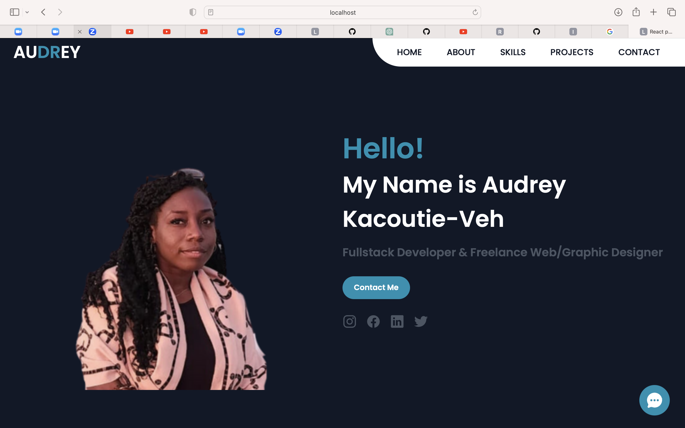

# Audrey-React-Portfolio

Welcome to my Web Developer Portfolio! This portfolio showcases my work, provides information about me, and offers a way to get in touch.

## Table of Contents
- [Description](#description)
- [Features](#features)
- [Demo](#demo)
- [Technologies Used](#technologies-used)
- [How to Use](#how-to-use)
- [Contact](#contact)
- [License](#license)

## Description

This is a single-page application portfolio for a web developer. It was built to fulfill the following requirements:

- Display a header with navigation links to different sections of the portfolio.
- Highlight the current section in the navigation.
- Smoothly scroll to sections when a navigation link is clicked.
- Default to the "About Me" section when the page loads.
- Provide an "About Me" section with a photo and bio.
- Include a "Portfolio" section with project images linked to deployments and GitHub repositories.
- Offer a "Contact" section with a form for name, email, and message.
- Validate form fields for required input and email format.
- Present a "Resume" section with a link to download the resume and a list of proficiencies.
- Display text or icon links to the developer's GitHub and LinkedIn profiles in the footer.

## Features

- Header with navigation links.
- Smooth scrolling to sections.
- "About Me" section with a photo and bio.
- "Portfolio" section with project images and links.
- "Contact" section with form validation.
- Footer with links to GitHub and LinkedIn profiles.

## Preview




## Technologies Used

- HTML
- Vite.js
- CSS
- JavaScript
- React

## How to Use

To run this portfolio locally or contribute to it, follow these steps:

1. Clone the repository:

   ```bash
   git clone git@github.com:audidi29/Audrey-React-Portfolio.git
   ```

2. Navigate to the project directory:

   ```bash
   cd Audrey-React-Portfolio
   ```

3. Install dependencies:

   ```bash
   npm install
   ```

4. Start the development server:

   ```bash
   npm run dev
   ```

5. Open your web browser and visit [http://localhost:8003/] to view the portfolio locally.

## Contact

- Email: laetitia.ama@gmail.com
- Deploy Link : https://audidi29.github.io/Audrey-React-Portfolio/
- LinkedIn: [https://www.linkedin.com/in/laetitia-audrey-kacoutie-veh-879102ba/](#)
- GitHub: [https://github.com/audidi29/Audrey-React-Portfolio](#)

## License

This project is licensed under the [MIT License](LICENSE).
